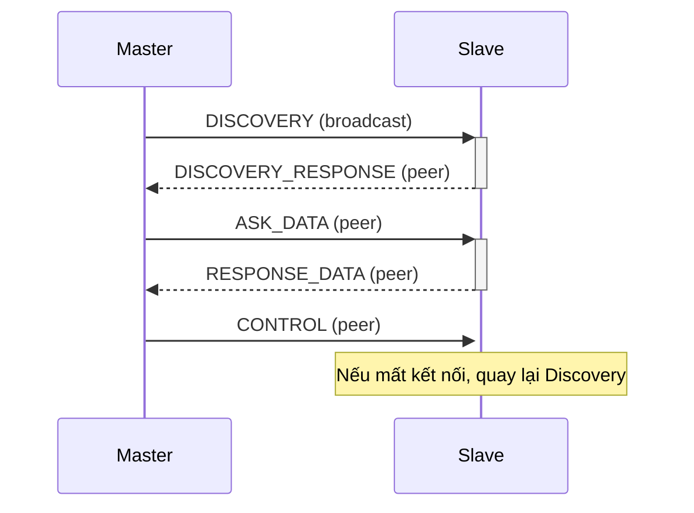

# ESP-NOW Slave (DHT11) - Luồng hoạt động và Định dạng bản tin

## 1. Luồng hoạt động tổng quát

### 1.1. Chế độ chờ (Discovery)
- **Slave** khởi động, thêm địa chỉ MAC broadcast (`FF:FF:FF:FF:FF:FF`) vào peer list để lắng nghe bản tin từ master.
- Khi nhận được bản tin `DISCOVERY` từ master (gửi broadcast):
  - Thêm tạm thời địa chỉ MAC của master vào peer list.
  - Gửi lại bản tin `DISCOVERY_RESPONSE` về cho master (gửi peer-to-peer).

### 1.2. Giao tiếp dữ liệu (Pairing & Data)
- Khi nhận được bản tin `ASK_DATA` từ master:
  - Nếu chưa pair, slave sẽ:
    - Đánh dấu đã pair (`s_is_master_paired = true`), lưu MAC master.
    - Thêm master vào peer list (nếu chưa có).
    - Xóa peer broadcast (không còn lắng nghe broadcast nữa).
  - Đọc dữ liệu cảm biến, gửi bản tin `RESPONSE_DATA` về cho master (gửi peer-to-peer).

### 1.3. Nhận lệnh điều khiển (CONTROL)
- Nếu nhận bản tin `CONTROL` từ master:
  - Nếu chưa pair, thực hiện pair như trên.
  - Xóa peer broadcast, chỉ nhận/gửi với master.

### 1.4. Kiểm tra kết nối
- Nếu quá thời gian không nhận được bản tin từ master:
  - Unpair, xóa peer master, thêm lại peer broadcast để quay về chế độ chờ.

---

## 2. Định dạng bản tin JSON

### 2.1. Từ Master gửi Slave

#### a. Bản tin DISCOVERY
```json
{
  "type": 0,           // JSON_MSG_TYPE_DISCOVERY
  "id": "MAC_MASTER" // Địa chỉ MAC dạng chuỗi
}
```

#### b. Bản tin ASK_DATA
```json
{
  "type": 2,           // JSON_MSG_TYPE_ASK_DATA
  "id": "MAC_MASTER"
}
```

#### c. Bản tin CONTROL
```json
{
  "type": 4,           // JSON_MSG_TYPE_CONTROL
  "id": "MAC_MASTER",
  "has_cmd": true,
  "cmd": 0             // JSON_CMD_REGISTER_SUCCESS
}
```

### 2.2. Từ Slave gửi Master

#### a. Bản tin DISCOVERY_RESPONSE
```json
{
  "type": 1,           // JSON_MSG_TYPE_DISCOVERY_RESPONSE
  "id": "MAC_SLAVE",
  "name": "DHT11_Sensor_1"
}
```

#### b. Bản tin RESPONSE_DATA
```json
{
  "type": 3,           // JSON_MSG_TYPE_RESPONSE_DATA
  "id": "MAC_SLAVE",
  "dst": "MAC_MASTER",
  "data": {
    "temp": 25,        // Nhiệt độ
    "humi": 60         // Độ ẩm
  }
}
```

---

## 3. Sơ đồ luồng hoạt động



---

## 4. Ghi chú
- Sau khi pair, slave chỉ giao tiếp với master, không nhận broadcast nữa.
- Nếu mất kết nối, slave sẽ trở lại chế độ chờ (lắng nghe broadcast).
- Định dạng bản tin có thể mở rộng thêm trường nếu cần.
